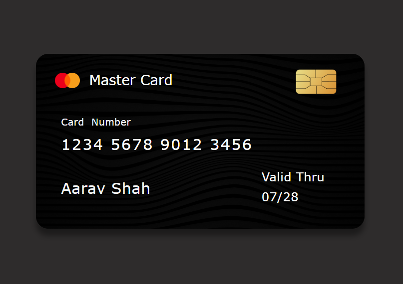

# Credit Card UI

This project is a simple and static **Credit Card UI** built using HTML and CSS. It showcases a stylized representation of a credit card, including elements such as the card number, user name, valid-through date, and more.

---

## Features

- **Responsive Design**: The layout adapts for smaller screens using media queries.
- **Modern Styling**: Uses flexbox and CSS styling for an attractive appearance.
- **Customizable**: Easily update card details by modifying the HTML.

---

## Technologies Used

- **HTML5**
- **CSS3**

---

## Preview

